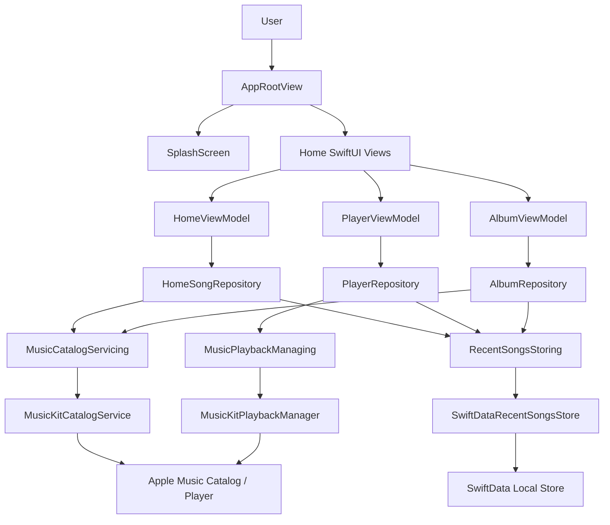

# MusicConector

MusicConector is an iOS music app built with SwiftUI, SwiftData, Swift 6, and MusicKit. It lets users launch into a branded splash experience, search the Apple Music catalog, browse recent songs from local cache, play full songs when Apple Music is available, and open album details from a song options sheet.

This repository does not store PRD files. The implemented scope is documented here based on the current `main` branch.

## Current Capabilities

The current app includes:

- Launch splash screen with phone and iPad-specific assets.
- Apple Music catalog search through MusicKit.
- Paginated song results.
- Recently played songs loaded from local SwiftData storage.
- Offline-friendly local cache for recently played songs, viewed songs, and viewed album metadata.
- SwiftUI Home screen with search, loading, empty, result, error, pagination, and offline states.
- Song player screen with artwork, title, artist, progress, and playback controls.
- MusicKit-backed full-song play, pause, resume, authorization, availability, and progress updates.
- Playback unavailable states that keep search and browsing usable.
- More-options sheet with a View Album action when album metadata is available.
- Album screen with artwork, title, artist, track list, loading, empty, error, and cached fallback behavior.
- Adaptive navigation using `NavigationStack` for compact layouts and `NavigationSplitView` for regular layouts.
- Domain models for songs, artists, albums, playback state, and paged results.
- Protocol-based boundaries for catalog, playback, and persistence.
- Reusable design system tokens and music UI components.
- Swift Testing coverage for domain behavior, cache behavior, repositories, ViewModels, adaptive layout, splash assets, and design system basics.

## Requirements Covered

| Requirement | Current Status |
| --- | --- |
| Show a polished splash screen | Implemented |
| Search songs by text | Implemented |
| Load paginated results while scrolling | Implemented |
| Show recently played songs on Home | Implemented |
| Keep recent songs available from local storage | Implemented |
| Open a song player screen | Implemented |
| Play and pause full songs with Apple Music access | Implemented |
| Keep search and browsing available without playback authorization | Implemented |
| Show clear unavailable-playback states | Implemented |
| Show a song more-options sheet | Implemented |
| Open a song album from the sheet | Implemented |
| Show album artwork, title, artist, and tracks | Implemented |
| Support compact iPhone navigation | Implemented |
| Support adaptive iPad split layout | Implemented |
| Abstract MusicKit, playback, and cache behind protocols | Implemented |
| Provide Swift Testing coverage for core modules and ViewModels | Implemented |

## Architecture

MusicConector uses a modular MVVM architecture with clear boundaries between presentation, feature repositories, domain contracts, data implementations, and reusable UI.

```text
musicconector/
|-- App/
|   |-- AppRootView.swift
|   `-- musicconectorApp.swift
|-- Core/
|   |-- Domain/
|   |   |-- Models/
|   |   `-- Services/
|   |-- Data/
|   |   |-- MusicKit/
|   |   `-- Persistence/
|   |-- Music/
|   `-- Persistence/
|-- DesignSystem/
|   |-- Components/
|   `-- Tokens/
`-- Features/
    |-- Album/
    |-- Home/
    |-- Player/
    `-- Splash/
```

### Applied Pattern

The app follows these rules:

- SwiftUI views own rendering, layout, navigation, and user interaction.
- `@Observable` ViewModels own screen state and user-driven behavior.
- Feature repositories coordinate use-case-specific data access.
- Domain protocols define stable boundaries between features and infrastructure.
- MusicKit and SwiftData implementations stay outside presentation code.
- Design system components and tokens are shared across screens.
- Tests use fakes, spies, and in-memory dependencies instead of real Apple Music or persistent device state.

## System Design



## Main Data Flows

### Launch Flow

1. `musicconectorApp` creates the SwiftData `ModelContainer`.
2. `AppRootView` shows `SplashScreen` for the minimum launch duration.
3. The app requests Apple Music authorization through `MusicKitAuthorizationProvider`.
4. The app transitions to the Home experience without blocking metadata browsing when playback is unavailable.

### Search Flow

1. The user enters a search term in the Home screen.
2. `HomeViewModel` trims and validates the term.
3. `HomeViewModel` asks `HomeSongRepository` for a page of results.
4. `DefaultHomeSongRepository` delegates catalog access to `MusicCatalogServicing`.
5. `MusicKitCatalogService` queries MusicKit and maps results into domain `Song` values.
6. The ViewModel updates the screen state to loading, results, empty, error, or pagination error.

### Recent Songs Flow

1. The Home screen starts by loading recent songs.
2. `HomeViewModel` asks `HomeSongRepository` for recent songs.
3. `DefaultHomeSongRepository` delegates persistence to `RecentSongsStoring`.
4. `SwiftDataRecentSongsStore` reads cached songs from SwiftData.
5. The ViewModel shows recent songs or an offline state if local storage is unavailable.

### Playback Flow

1. The user selects a song and opens `PlayerContainerView`.
2. `PlayerViewModel` loads playback availability and current state through `PlayerRepository`.
3. `DefaultPlayerRepository` delegates playback to `MusicPlaybackManaging`.
4. `MusicKitPlaybackManager` controls `ApplicationMusicPlayer`.
5. Playback progress is streamed back to the ViewModel through `AsyncStream<PlaybackState>`.
6. Successfully played songs are saved through `RecentSongsStoring`.

### Album Flow

1. The user opens the more-options sheet for a song.
2. If the song has an album ID, the View Album action opens `AlbumContainerView`.
3. `AlbumViewModel` first tries cached album metadata.
4. `DefaultAlbumRepository` fetches album details through `MusicCatalogServicing`.
5. Loaded albums and tracks are cached through `RecentSongsStoring`.
6. If the remote fetch fails and cached album data exists, the Album screen renders the cached fallback.

## Core Interfaces

Catalog access is defined by `MusicCatalogServicing`:

```swift
protocol MusicCatalogServicing {
    func searchSongs(term: String, page: PageRequest) async throws -> PagedResult<Song>
    func song(id: Song.ID) async throws -> Song
    func album(id: Album.ID) async throws -> Album
}
```

Playback access is defined by `MusicPlaybackManaging`:

```swift
protocol MusicPlaybackManaging {
    func requestAuthorization() async -> MusicAuthorizationState
    func currentState() async -> PlaybackState
    func play(song: Song) async throws
    func pause() async
    func resume() async throws
    func progressUpdates(every interval: Duration) -> AsyncStream<PlaybackState>
}
```

Local music cache access is defined by `RecentSongsStoring`:

```swift
protocol RecentSongsStoring {
    func saveRecentlyPlayed(_ song: Song, playedAt: Date) async throws
    func saveViewedSong(_ song: Song, viewedAt: Date) async throws
    func saveViewedAlbum(_ album: Album, viewedAt: Date) async throws
    func recentlyPlayed(limit: Int) async throws -> [Song]
    func cachedSong(id: Song.ID) async throws -> Song?
    func cachedAlbum(id: Album.ID) async throws -> Album?
}
```

## Requirements

- Xcode with Swift 6 support.
- iOS Simulator or physical iOS device.
- Apple Music / MusicKit capability available for runtime catalog and playback behavior.
- Network access for live catalog search and album loading.
- Apple Music authorization for full-song playback.
- Local SwiftData storage for cached recent songs and viewed album metadata.

## Build

List available schemes:

```bash
xcodebuild -list -project musicconector/musicconector.xcodeproj
```

Build the app:

```bash
xcodebuild build \
  -project musicconector/musicconector.xcodeproj \
  -scheme musicconector \
  -destination 'platform=iOS Simulator,name=iPhone 16'
```

Open the project in Xcode:

```bash
open musicconector/musicconector.xcodeproj
```

## Test

Run the main test suite:

```bash
xcodebuild test \
  -project musicconector/musicconector.xcodeproj \
  -scheme musicconector \
  -destination 'platform=iOS Simulator,name=iPhone 16'
```

The current tests focus on:

- Domain models and service contracts.
- MusicKit mapping behavior.
- SwiftData cache behavior with in-memory test data.
- Home ViewModel states.
- Search, pagination, empty results, errors, and offline state.
- Player ViewModel playback, progress, authorization, fallback, and persistence behavior.
- Album ViewModel loading, empty, error, cache, and fallback behavior.
- Repository dependency boundaries.
- Adaptive layout decisions.
- Splash asset selection.
- Design system component basics.

## Large-Scale Project Standard

As the app grows, each feature should preserve the same boundaries:

```text
Features/<FeatureName>/
|-- <FeatureName>ContainerView.swift
|-- <FeatureName>Dependencies.swift
|-- <FeatureName>Repository.swift
|-- <FeatureName>Screen.swift
`-- <FeatureName>ViewModel.swift
```

For larger features, split the same responsibilities into subfolders without changing the dependency direction:

```text
Features/<FeatureName>/
|-- Data/
|   `-- Feature repositories or adapters
|-- Presentation/
|   |-- ViewModels/
|   `-- Views/
`-- <FeatureName>Dependencies.swift
```

Guidelines for scale:

- Keep feature code isolated by product area.
- Keep domain models and protocols in `Core/Domain`.
- Keep external integrations in `Core/Data`.
- Keep SwiftUI views free of direct MusicKit, SwiftData, or network calls.
- Inject dependencies through lightweight environment or initializer-based composition.
- Add tests at ViewModel, repository, mapper, and persistence boundaries.
- Prefer small, reviewable changes over broad rewrites.
